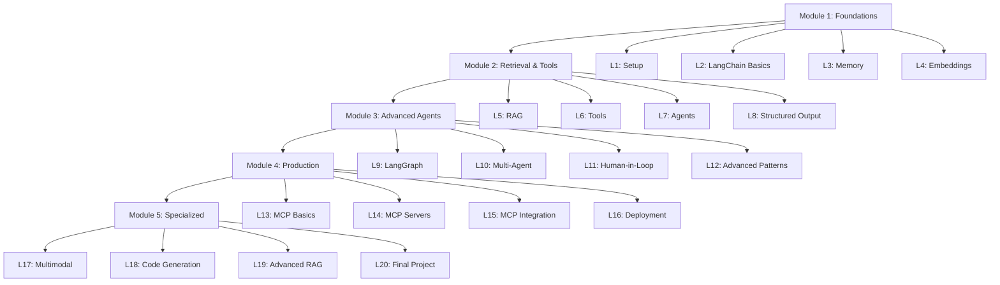

# AI Engineering Course - Complete Lesson Plan

## Course Architecture



## Module 1: Foundations (Lessons 2-4)

### Lesson 2: LangChain Basics

**Files**: README.md, demo.py, challenge.py, solution.py

**Theory**:

- LangChain architecture (chains, prompts, models)
- PromptTemplates and variable injection
- Output parsers
- Chain composition (LLMChain, SequentialChain)
- Runnable interface (LCEL)

**Demo**:

- Basic prompt templates
- Chain composition
- LCEL syntax
- Streaming with chains

**Challenge**: Build a multi-step research assistant that takes a topic, generates 3 research questions, answers each, and synthesizes findings.

---

### Lesson 3: Memory

**Files**: README.md, demo.py, challenge.py, solution.py

**Theory**:

- Memory types (ConversationBufferMemory, ConversationSummaryMemory, ConversationBufferWindowMemory)
- Message history management
- Memory with chains
- Custom memory implementations

**Demo**:

- Different memory types comparison
- Memory with LangChain chains
- Persistent memory with file storage

**Challenge**: Create a chatbot with personality that remembers user preferences across sessions (save/load from JSON).

---

### Lesson 4: Embeddings

**Files**: README.md, demo.py, challenge.py, solution.py, data/ folder

**Theory**:

- Vector embeddings explained
- Similarity search (cosine, euclidean)
- Vector databases (ChromaDB, FAISS)
- Embedding models (Ollama embeddings)
- Chunking strategies

**Demo**:

- Generate embeddings with Ollama
- Store in ChromaDB and FAISS
- Semantic search examples
- Document chunking

**Challenge**: Build a semantic FAQ system that loads Q&A pairs, embeds them, and returns the most relevant answer for user queries.

---

## Module 2: Retrieval & Tools (Lessons 5-8)

### Lesson 5: RAG (Retrieval Augmented Generation)

**Files**: README.md, demo.py, challenge.py, solution.py, documents/ folder

**Theory**:

- RAG architecture
- Document loaders (PDF, TXT, web)
- Text splitters
- Retrieval strategies
- RAG chain construction

**Demo**:

- Load and chunk documents
- Build vector store
- Create RAG chain
- Query with source citations

**Challenge**: Build a document Q&A system that ingests PDFs, creates a vector store, and answers questions with source citations.

---

### Lesson 6: Tools

**Files**: README.md, demo.py, challenge.py, solution.py

**Theory**:

- Tool concept in LangChain
- Function calling vs tool use
- Built-in tools (calculator, search, etc.)
- Custom tool creation
- Tool error handling

**Demo**:

- Create custom tools (calculator, weather API, file reader)
- Tool with multiple parameters
- Tool validation with Pydantic

**Challenge**: Build a tool suite (calculator, unit converter, date calculator) and create an LLM that can use them.

---

### Lesson 7: Agents

**Files**: README.md, demo.py, challenge.py, solution.py

**Theory**:

- Agent types (ReAct, function calling)
- Agent reasoning loop
- Tool selection
- Agent memory
- Error recovery

**Demo**:

- ReAct agent with tools
- Agent with memory
- Debugging agent reasoning
- Agent with custom prompts

**Challenge**: Build a research agent that can search Wikipedia, do calculations, and write findings to a file.

---

### Lesson 8: Structured Output

**Files**: README.md, demo.py, challenge.py, solution.py

**Theory**:

- Pydantic models for validation
- JSON mode
- Function calling for structured output
- Output fixing chains
- Enum and nested models

**Demo**:

- Extract structured data from text
- Complex nested models
- Validation and error handling
- Batch processing

**Challenge**: Build an email parser that extracts sender, recipients, subject, sentiment, action items, and priority from email text.

---

## Module 3: Advanced Agents (Lessons 9-12)

### Lesson 9: LangGraph

**Files**: README.md, demo.py, challenge.py, solution.py, graph_viz.py

**Theory**:

- Graph-based agent architecture
- Nodes, edges, and state
- Conditional edges
- Cycles and loops
- Checkpointing

**Demo**:

- Simple linear graph
- Conditional routing
- Cyclic graph with max iterations
- State management
- Graph visualization

**Challenge**: Build a content moderation pipeline (detect language → check toxicity → route to human/auto-approve → log decision).

---

### Lesson 10: Multi-Agent Systems

**Files**: README.md, demo.py, challenge.py, solution.py

**Theory**:

- Multi-agent patterns
- Agent communication
- Supervisor pattern
- Hierarchical agents
- Agent coordination

**Demo**:

- Two-agent collaboration
- Supervisor with worker agents
- Agent handoff
- Shared state management

**Challenge**: Build a software team simulator (PM agent, developer agent, QA agent) that collaborates to plan and "implement" a feature.

---

### Lesson 11: Human-in-the-Loop

**Files**: README.md, demo.py, challenge.py, solution.py

**Theory**:

- Approval workflows
- Interrupt patterns
- Checkpointing and resumption
- Feedback integration
- Audit trails

**Demo**:

- Approval gates in LangGraph
- Save/resume workflow
- Human feedback integration
- Audit logging

**Challenge**: Build an expense approval system where agents categorize expenses, flag suspicious ones, and require human approval for high amounts.

---

### Lesson 12: Advanced Patterns

**Files**: README.md, demo.py, challenge.py, solution.py

**Theory**:

- Self-reflection and critique
- Plan-and-execute pattern
- Tree of thoughts
- Agent retry strategies
- Fallback chains

**Demo**:

- Self-correcting agent
- Plan-execute-revise loop
- Multi-path exploration
- Graceful degradation

**Challenge**: Build a code review agent that writes code, critiques it, revises it, and repeats until quality threshold is met.

---

## Module 4: Production & Integration (Lessons 13-16)

### Lesson 13: MCP Basics

**Files**: README.md, demo.py, challenge.py, solution.py

**Theory**:

- Model Context Protocol overview
- MCP architecture (client, server, transport)
- Resources, tools, and prompts
- Protocol messages
- Security considerations

**Demo**:

- Connect to MCP server
- List available tools
- Call MCP tools
- Handle MCP responses

**Challenge**: Build an MCP client that connects to a filesystem server and performs file operations via natural language.

---

### Lesson 14: MCP Servers

**Files**: README.md, server.py, client_demo.py, challenge.py, solution.py

**Theory**:

- Building MCP servers
- Tool registration
- Resource providers
- Error handling
- Server configuration

**Demo**:

- Simple MCP server with tools
- Database MCP server
- API wrapper MCP server
- Server testing

**Challenge**: Build an MCP server that provides tools for managing a TODO list (add, list, complete, delete tasks).

---

### Lesson 15: MCP Integration

**Files**: README.md, demo.py, challenge.py, solution.py, servers/

**Theory**:

- Integrating MCP with LangChain
- MCP with LangGraph
- Multi-server coordination
- Dynamic tool discovery
- Error recovery

**Demo**:

- LangChain agent with MCP tools
- LangGraph with MCP integration
- Multiple MCP servers
- Fallback strategies

**Challenge**: Build an agent that uses multiple MCP servers (filesystem, database, API) to build a data pipeline.

---

### Lesson 16: Deployment

**Files**: README.md, api.py, docker-compose.yml, Dockerfile, deploy.sh, test_api.py

**Theory**:

- FastAPI for AI services
- Async patterns
- Streaming responses
- Rate limiting
- Monitoring and logging
- Docker containerization
- Environment management

**Demo**:

- FastAPI RAG endpoint
- Streaming SSE responses
- Health checks
- Docker deployment
- Load testing

**Challenge**: Deploy a production RAG API with authentication, rate limiting, and monitoring.

---

## Module 5: Specialized Topics (Lessons 17-20)

### Lesson 17: Multimodal AI

**Files**: README.md, demo.py, challenge.py, solution.py, images/, outputs/

**Theory**:

- Vision models (llama3.2-vision)
- Image understanding
- Image + text prompting
- OCR and document analysis
- Multimodal RAG

**Demo**:

- Image description
- Visual question answering
- Document extraction
- Image comparison
- Chart analysis

**Challenge**: Build a receipt analyzer that extracts items, prices, totals, and categorizes expenses from receipt images.

---

### Lesson 18: Code Generation

**Files**: README.md, demo.py, challenge.py, solution.py, templates/

**Theory**:

- Code LLMs (CodeLlama)
- Prompt engineering for code
- Code validation and testing
- Multi-file generation
- Code explanation and documentation

**Demo**:

- Function generation
- Test generation
- Code refactoring
- Documentation generation
- Bug fixing

**Challenge**: Build a code generator that takes a feature description, generates Python code, writes tests, and validates the output.

---

### Lesson 19: Advanced RAG

**Files**: README.md, demo.py, challenge.py, solution.py, advanced_techniques.py

**Theory**:

- Query transformation
- Hypothetical document embeddings (HyDE)
- Multi-query retrieval
- Re-ranking
- Parent-child chunking
- Metadata filtering
- Hybrid search

**Demo**:

- Query rewriting
- HyDE implementation
- Re-ranking with cross-encoders
- Advanced chunking strategies
- Metadata filtering

**Challenge**: Build an advanced RAG system with query transformation, multi-query retrieval, re-ranking, and answer synthesis.

---

### Lesson 20: Final Project

**Files**: README.md, project_ideas.md, evaluation_rubric.md

**Theory**:

- Project planning
- Architecture design
- Testing strategies
- Documentation
- Presentation

**Project Options**:

1. **AI Research Assistant**: Multi-agent system with web search, document analysis, and report generation
2. **Code Review Bot**: Analyzes PRs, suggests improvements, checks for bugs, generates tests
3. **Customer Support Agent**: RAG over docs, ticket classification, response generation, escalation
4. **Data Analysis Assistant**: Natural language to SQL, chart generation, insight extraction
5. **Custom Project**: Student-designed project with approval

**Requirements**:

- Use LangGraph for orchestration
- Implement at least 3 custom tools
- Include RAG or structured output
- Deploy as API
- Write tests
- Create documentation

**Deliverables**:

- Working code
- README with setup instructions
- Architecture diagram
- Demo video or screenshots
- Reflection document

---

## Implementation Strategy

### File Structure Per Lesson

```
lessonX-topic/
├── README.md          # Theory + instructions
├── demo.py            # Working examples
├── challenge.py       # Starter code with TODOs
├── solution.py        # Complete solution
├── test_solution.py   # Optional tests
├── data/              # Optional data files
└── requirements.txt   # Optional lesson-specific deps
```

### README Template

1. **Theory** (20-30%): Core concepts, diagrams
2. **Demo** (30-40%): Code examples with explanations
3. **Challenge** (30-40%): Hands-on exercise with requirements
4. **Resources** (10%): Links to docs and further reading

### Progressive Complexity

- Early lessons: Single file, clear structure
- Mid lessons: Multiple files, more abstraction
- Late lessons: Production patterns, testing, deployment

### Code Quality Standards

- Type hints throughout
- Docstrings for functions/classes
- Error handling
- Logging where appropriate
- Comments for complex logic

---

## Key Dependencies by Module

**Module 1**: `langchain`, `langchain-community`, `ollama`

**Module 2**: `chromadb`, `faiss-cpu`, `pypdf`, `beautifulsoup4`

**Module 3**: `langgraph`, `pydantic`

**Module 4**: `mcp`, `fastapi`, `uvicorn`, `httpx`

**Module 5**: `matplotlib`, `pandas`, `pytest`

---

## Estimated Timeline

- **Module 1** (4 lessons): 1-2 weeks
- **Module 2** (4 lessons): 2-3 weeks  
- **Module 3** (4 lessons): 2-3 weeks
- **Module 4** (4 lessons): 1-2 weeks
- **Module 5** (4 lessons): 2-3 weeks

**Total**: 8-13 weeks at 5-10 hours/week

---

## Next Steps

1. Create lesson content in order (2 → 20)
2. Each lesson includes: README, demo, challenge, solution
3. Test all code with Ollama models
4. Add data files where needed
5. Create helper scripts for common tasks
6. Add visualization tools for graphs
7. Create evaluation rubrics for challenges